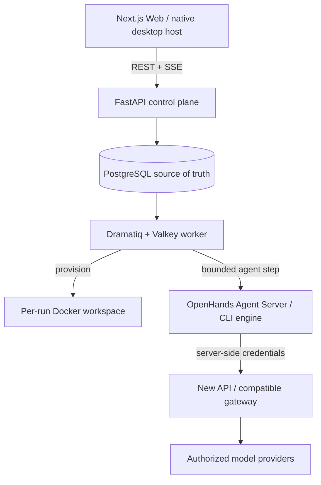

<div align="center">
  
  <h1>BudgetLoop</h1>
  <p><strong>A budget-aware control plane for coding agents that plans, executes, verifies, recovers, and stops on your terms.</strong></p>
</div>

<div align="center">
  <a href="https://github.com/bei666qi-pan/BudgetLoop/releases/latest"></a>
  <a href="https://github.com/bei666qi-pan/BudgetLoop/actions/workflows/release.yml"></a>
  <a href="./LICENSE"></a>
</div>

<div align="center">
  <a href="#quickstart">Quickstart</a> ·
  <a href="#desktop-apps">Desktop apps</a> ·
  <a href="#how-it-works">How it works</a> ·
  <a href="#architecture">Architecture</a> ·
  <a href="#development">Development</a>
</div>

<p align="center"><strong>English</strong> · <a href="./README.zh-CN.md">简体中文</a></p>

BudgetLoop turns an open-ended software request into an auditable operating loop. It runs real agents, tools, and tests; tracks token, time, call, and cost budgets; records evidence; adapts when progress stalls; and exposes the decisions that still require a human.

> [!IMPORTANT]
> BudgetLoop is an experimental, self-hosted system. Use only repositories, credentials, model providers, and Docker environments you trust.

## Latest release: v0.3.1

Web, backend, macOS, and Windows are built from the same `v0.3.1` source revision. Desktop launchers are native hosts for a local Docker-backed checkout; they do not bundle Docker, your repository, model credentials, or a hosted BudgetLoop service.

| Surface | Current version | Delivery | Requirements |
| --- | --- | --- | --- |
| **Web** | `0.3.1` | Docker Compose at `http://localhost:3000` | Docker Desktop/Engine + Compose v2 |
| **macOS app** | `0.3.1` | [Download ZIP](https://github.com/bei666qi-pan/BudgetLoop/releases/download/v0.3.1/BudgetLoop-v0.3.1-macos.zip) | macOS 13+, Docker Desktop, local BudgetLoop checkout |
| **Windows app** | `0.3.1` | [Download MSI](https://github.com/bei666qi-pan/BudgetLoop/releases/download/v0.3.1/BudgetLoop-v0.3.1-windows-x64.msi) | Windows 10/11, Docker Desktop, WebView2, local checkout |
| **Backend / worker** | `0.3.1` | Included in Docker Compose | Python 3.12+ for source development |

[Release notes](https://github.com/bei666qi-pan/BudgetLoop/releases/tag/v0.3.1) · [SHA-256 checksums](https://github.com/bei666qi-pan/BudgetLoop/releases/download/v0.3.1/SHA256SUMS) · [All releases](https://github.com/bei666qi-pan/BudgetLoop/releases)

## Why BudgetLoop?

| What you need | What BudgetLoop provides |
| --- | --- |
| **Budgets you can trust** | Atomic reservation and settlement of token, call, cost, and time limits around real model calls. |
| **Evidence, not agent theatre** | Tool output, test results, exit codes, timing, artifacts, diffs, and lifecycle events. |
| **Agent Teams with control** | Guided or autonomous teams, parallel eligible stages, explicit handoffs, and operator approvals. |
| **Workspace safety** | Per-run Docker workspaces, server-generated Git worktrees, explicit direct-folder authorization, and fail-closed startup. |
| **Honest progress** | Visible workspace/agent startup stages, an animated waiting state, bounded retries, and actionable terminal failures. |
| **Recovery instead of blind retries** | Deterministic progress signals drive strategy changes, rollback, minimal-fix mode, or an explainable partial result. |

## Quickstart

### 1. Start the latest Web stack

Prerequisites: Docker Desktop or Docker Engine, Docker Compose v2, Git, and an authorized model gateway.

```bash
git clone --branch v0.3.1 https://github.com/bei666qi-pan/BudgetLoop.git
cd BudgetLoop
cp .env.example .env
# Replace every replace-with-* value in .env.
docker compose up -d --build
```

Open [http://localhost:3000](http://localhost:3000). The bundled New API console is available at [http://localhost:3001](http://localhost:3001) for first-time administrator, channel, model alias, and token setup.

After adding the gateway token to `.env`, refresh the application services:

```bash
docker compose up -d --build control-plane worker web
```

### 2. Create an Agent Team

1. Describe the result you want on the home page.
2. Review the suggested team, engine, acceptance criteria, budget, and file access.
3. Select **Confirm and start**. Draft generation alone does not create a task or spend execution budget.
4. Follow literal startup states: queued → preparing workspace → starting agent → running, or a named failure with a recovery action.

## Desktop apps

Both launchers refresh only the stateless `control-plane`, `worker`, and `web` services. They preserve `.env`, PostgreSQL, Valkey, New API, and Docker volumes.

### macOS

1. Clone or update the repository to tag `v0.3.1`.
2. Download and extract `BudgetLoop-v0.3.1-macos.zip` into the repository root, or build it locally with `./desktop/build.sh`.
3. Start Docker Desktop and open `BudgetLoop.app`.

The current archive is ad-hoc signed for integrity but is not Apple-notarized. macOS may require an explicit **Open** confirmation for the first launch.

### Windows

1. Clone or update the repository to tag `v0.3.1`.
2. Install `BudgetLoop-v0.3.1-windows-x64.msi` from the release.
3. Start Docker Desktop, open BudgetLoop, and choose the checkout containing `docker-compose.yml` when prompted.

The current MSI is CI-built but not Authenticode-signed. Windows SmartScreen may show an unrecognized-publisher warning. Microsoft Edge WebView2 Runtime is required and is normally included with current Windows releases.

## How it works

```text
Describe a goal → plan work → run model + tools → inspect evidence → adapt or finish
        ↑                                                        ↓
        └──── approvals, budgets, rollback, handoffs, reports ───┘
```

Every run has a durable task, budget, execution timeline, workspace, approval state, test evidence, and final report. BudgetLoop does not treat a model's claim as proof that work completed.

Startup is bounded and observable. While a workspace or agent conversation is being prepared, the UI shows the current stage and elapsed wait state. Repeated provisioning failures become a terminal error with the preserved diagnosis instead of leaving the operator at an indefinite spinner.

## Architecture



| Layer | Technology |
| --- | --- |
| Operator experience | Next.js 15, React 19, TypeScript, Tailwind CSS, SSE |
| Control plane | FastAPI, SQLAlchemy, PostgreSQL 16 |
| Queue and transient state | Dramatiq, Valkey |
| Agent runtime | OpenHands Software Agent SDK and supported CLI engines |
| Execution isolation | Per-run Docker workspaces; optional server-generated Git worktrees |
| Model gateway | QuantumNous New API by default; compatible server-side profiles |
| Desktop | Swift/AppKit on macOS; Rust/Tauri/WebView2 on Windows |

## Safety model

- **Isolated workspace is the default.** A run writes to its own Docker-backed workspace.
- **Direct project access is explicit.** It requires a normalized absolute path, acknowledgement, final confirmation, and a compatible engine; Agent Teams receive separate server-generated worktrees.
- **No silent fallback.** Mount, worktree, or agent startup failures stop the run instead of executing somewhere else.
- **Credentials stay server-side.** Browser bundles and responses do not receive gateway or provider keys.
- **Risk can require approval.** Writes, commands, and network actions can be gated by the operator.

## Gateway configuration

The default stack includes [QuantumNous New API](https://github.com/QuantumNous/new-api). Configure authorized channels and a token, then set:

```dotenv
AI_GATEWAY_TYPE=new-api
AI_GATEWAY_BASE_URL=http://new-api:3000
AI_GATEWAY_API_KEY=replace-with-your-gateway-token
AI_GATEWAY_RECOMMENDATION_MODEL=budgetloop-recommendation
```

Do not commit `.env` or include credentials in screenshots and issue reports.

## Development

```bash
# Backend
cd backend
python -m venv .venv
source .venv/bin/activate
pip install -e ".[dev]"
pytest

# Web (separate shell)
cd web
npm ci
npm test
npm run build

# macOS launcher
./desktop/build.sh

# Windows launcher (on Windows)
cd desktop/windows
npm ci
cargo test --manifest-path src-tauri/Cargo.toml
npm run tauri -- build --bundles msi
```

Verify that every release surface matches the root version:

```bash
python3 scripts/check_release_version.py
```

```text
backend/    API, orchestration, budgets, policies, worker
web/        Browser operator experience
desktop/    macOS and Windows native launchers
openspec/   Versioned product requirements and change history
docs/       Demonstration and release documentation
```

Meaningful behavior and architecture changes use the repository's [OpenSpec workflow](./openspec/). See [docs/demo-guide.md](./docs/demo-guide.md) for demonstration flows.

## Release integrity

The `v0.3.1` tag runs one cross-platform workflow. It verifies version parity, backend tests, Web tests/build, macOS bundle version/signature, Windows launcher tests, and MSI creation before publishing either desktop asset. Compare downloads with `SHA256SUMS`:

```bash
shasum -a 256 -c SHA256SUMS   # macOS
sha256sum -c SHA256SUMS       # Linux / Git Bash
```

## Contributing

Issues and focused pull requests are welcome. Include tests for behavior changes and update the relevant OpenSpec requirements for meaningful product or architecture changes.

## License

BudgetLoop is available under the [MIT License](./LICENSE). Third-party components retain their own licenses; see [NOTICE](./NOTICE).
