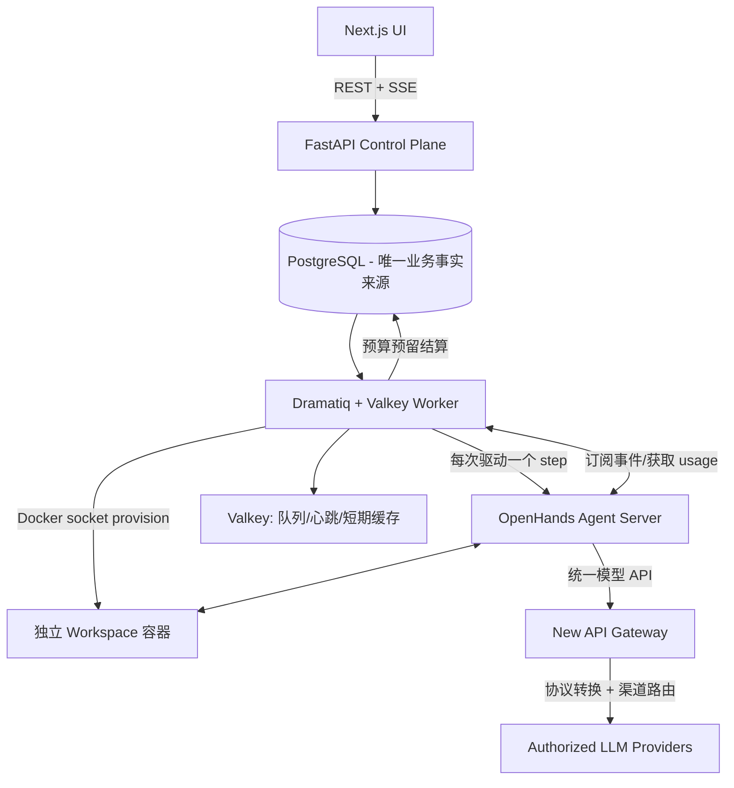
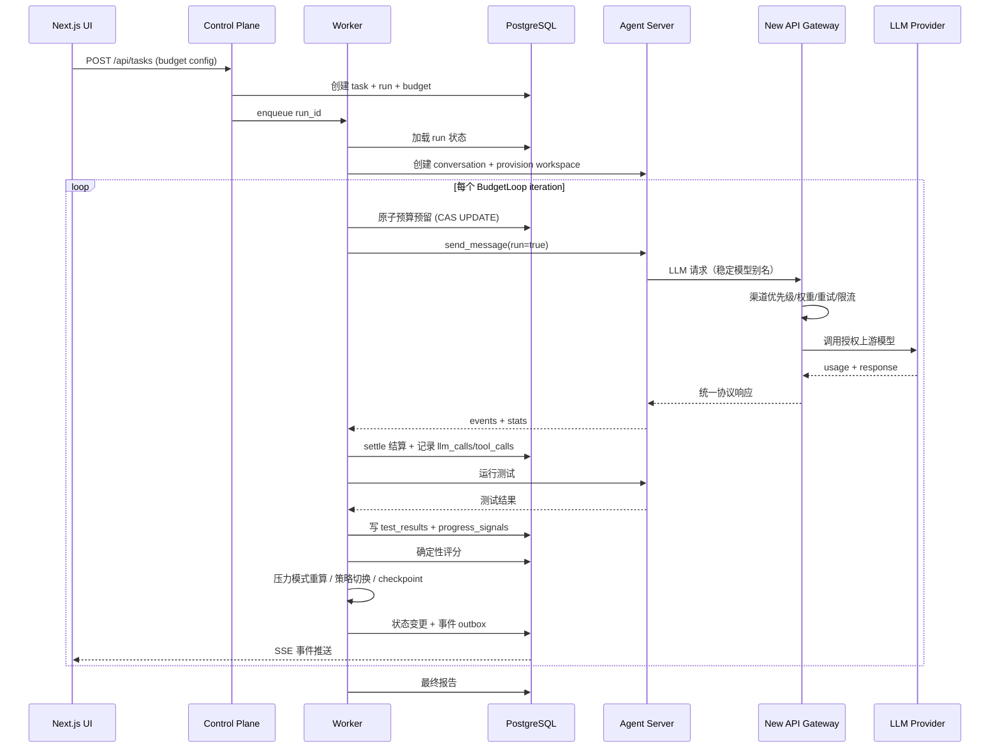

# BudgetLoop —— 预算感知、自我修复 Coding Agent

## 项目简介

BudgetLoop 是一个面向代码开发任务的 **预算感知、自我修复 Coding Agent**。它能在 Token、时间、调用次数和费用预算内，围绕明确开发目标执行闭环工作流：

> 任务输入 → 自动拆解与规划 → 调用 LLM + 开发工具 → 修改代码 →
> 执行测试与验证 → 读取反馈与日志 → 判断有效进展 → 调整计划 / 重试 /
> 切换策略 / 回滚 → 在预算内交付最终结果

**核心创新不是"显示 Token 用了多少"，而是：**

1. 对每一次真实大模型调用进行细粒度观测——Token/耗时/费用/有效性
2. 对整个任务设置资源上限，并在后端**原子化**强制拦截
3. 根据剩余预算、剩余时间和执行反馈**动态调整**后续策略
4. 识别低效、重复或无效调用并**主动降级**
5. 在预算不足时**输出可解释的部分完成结果**而非无限循环或直接中断
6. 新手友好的 UI 持续展示每一轮的计划、执行、反馈与修正

## 对应赛题

Loop Engineering 实践挑战 —— 构建真正闭环、预算可控、自我修复的 AI 编码代理。

## 与普通 Coding Agent 的区别

| 维度 | 普通 Coding Agent | BudgetLoop |
|---|---|---|
| 预算控制 | 最多展示累计 Token 数 | 每次调用前原子预检+预留；调用后按真实 usage 结算；多级拦截 |
| 进展感知 | 无或依赖 LLM 主观判断 | 确定性信号评分（测试结果/编译错误/diff/动作指纹重复）|
| 压力模式 | 无 | 双时间口径（wall clock + active runtime）+ Token 比例自适应升级 |
| 策略切换 | 机械重试 | 连续低分→改变假设；回归累积→回滚 checkpoint；紧急→最小修复 |
| 工具执行 | 模型声称的结果 | 所有工具真实执行、记录耗时/退出码/输出，存入 artifact 存储 |
| 审批 | 无或全自动 | 危险命令/越界写/网络访问可配置人工确认，拒绝理由作为反馈重规划 |
| 可观测性 | 扁平对话日志 | 逐次 LLM 调用、工具调用、事件时间线、预算燃尽图；OTel trace 可选 |

## 系统架构



## Loop 工作流程



## 技术栈

| 层 | 技术 |
|---|---|
| 前端 | Next.js 15 (App Router) + TypeScript + Tailwind CSS |
| 控制面 | FastAPI (Python 3.12+) |
| 工作队列 | Dramatiq + Valkey |
| 数据库 | PostgreSQL 16 (唯一业务事实来源) |
| Agent 内核 | OpenHands V1 Software Agent SDK (MIT) |
| 隔离执行 | Docker Workspace 容器 (per task_run) |
| 模型网关 | QuantumNous New API `v1.0.0-rc.21`（默认）/ LiteLLM（兼容） |
| 工件存储 | MinIO (Phase 3) / LocalVolume (Phase 1) |
| 观测 | OpenTelemetry (可选) / Langfuse (可选) |
| 部署 | Docker Compose 一键启动 |

## 环境变量

见 [.env.example](./.env.example)。核心配置：

- `NEW_API_SESSION_SECRET`：New API 会话密钥，必须使用长随机值。
- `AI_GATEWAY_API_KEY`：从 New API 控制台创建的网关 Token，只进入服务端。
- `AI_GATEWAY_RECOMMENDATION_MODEL`：推荐用途模型别名，默认 `budgetloop-recommendation`。
- `AI_RECOMMENDATION_ENABLED`：AI 优先推荐开关；无 AI 或调用失败时自动使用本地推荐。

## 本地运行步骤

```bash
# 1. 配置环境变量
cp .env.example .env
# 编辑 .env，至少更换所有 replace-with-* 值

# 2. Docker Compose 一键启动
docker compose up -d

# 3. 首次打开 New API 控制台，创建管理员、合法上游渠道、
#    budgetloop-recommendation 模型别名和网关 Token
open http://localhost:3001

# 4. 把 Token 写入 AI_GATEWAY_API_KEY 后重启应用服务
docker compose up -d control-plane worker

# 5. 打开 BudgetLoop
open http://localhost:3000
```

## 首页：一句话创建 Agent Team

首页现在是默认的新手入口：直接描述希望完成的结果，BudgetLoop 会生成一份可编辑的建议配置，
其中包括可信内置 Agent Team、角色分工、验收条件、执行引擎和硬预算。通常只需：

1. 输入目标并选择“生成建议配置”；
2. 检查目标、团队、资源上限和文件权限；
3. 选择“确认并启动”。

生成或修改草稿不会创建任务、消耗执行预算、挂载文件夹或投递 Agent；只有最后一次明确确认
才是提交边界。页面会如实标注 `AI 建议` 或 `本地可靠推荐`。网关未配置、超时或返回无效
结构时会自动使用确定性的本地 LangGraph 匹配，仍可继续创建，不会伪装成 AI 成功。

文件权限与 AI 推荐相互独立：

- **隔离工作区（默认）**：Agent 只写隔离副本，不直接修改任何宿主项目。
- **直接修改项目**：必须由操作员选择规范化绝对路径并再次勾选高风险确认；每个 Agent 使用
  独立、服务端生成的 Git worktree。提示词里出现路径或“完全访问”不构成授权。
- 在 `BudgetLoop.app` 中点击工具栏或权限卡的“选择文件夹”会打开 macOS 系统选择器；浏览器
  开发模式保留明确标注的绝对路径输入。

最近任务、搜索、状态筛选和审批入口仍在首页下方。需要更细控制时，可使用“手动配置单个任务”、
“浏览全部 Agent Team”或 `/containers/new`；这些高级路径不会把未确认草稿标记为已启动。

## 开发启动脚本

```bash
# 先启动基础服务
docker compose up -d postgres valkey new-api minio

# 后端 (venv)
cd backend
python -m venv .venv && source .venv/bin/activate
pip install -e ".[dev]"
alembic upgrade head
uvicorn app.main:app --reload --port 8000 &
dramatiq app.worker.actors -p 1 -t 4 &

# 前端
cd web && npm install && npm run dev
```

## AI 协作规范（OpenSpec）

本仓库默认采用 OpenSpec 的规范驱动工作流：对于功能、行为、接口或架构变更，先产出并确认 proposal / design / specs / tasks，再实施、验证、同步与归档。规范的唯一事实来源在 [`openspec/`](./openspec/)，仓库级默认策略见 [`AGENTS.md`](./AGENTS.md)。

已为所有 OpenSpec 支持的客户端生成项目内原生入口（包括 Codex、Kimi Code、Claude Code、Cursor、GitHub Copilot、Gemini CLI 等），因此不会绑定某一个代理：

- Codex：使用 `.codex/skills/openspec-*` 技能。
- Kimi Code：使用例如 `/skill:openspec-propose` 的技能入口。
- 其他支持命令的客户端：使用 `/opsx:explore`、`/opsx:propose`、`/opsx:apply`、`/opsx:sync`、`/opsx:archive`（具体命名以客户端的自动补全为准）。

更新 OpenSpec CLI 后，在仓库根目录执行 `openspec update` 即可重新生成全部客户端入口。

## 可替换执行引擎

BudgetLoop **不重新实现通用 Agent Loop**，也不 fork 上游 UI。BudgetLoop 始终拥有
TaskRun、预算、审批、Workspace、事件和 Handoff；引擎只执行有界工作：

- **Agent 推理与工具循环**：复用 OpenHands agent-server (`ghcr.io/openhands/agent-server`，MIT) 的 conversation 管理、工具执行、事件流、持久化与恢复能力。
- **Workspace 隔离**：worker 为每个 task_run 创建独立 Docker Workspace 容器（独立工作目录、资源限制、生命周期）。
- **事件模型**：BudgetLoop 的编排层通过 agent-server REST/WebSocket API 驱动 conversation，监听 `ActionEvent` / `ObservationEvent` / `ConversationStateUpdateEvent` 实现任务级闭环。
- **许可证与署名**：OpenHands 核心 (MIT) 在 NOTICE 中明确标注。不含 enterprise/ 目录受限代码。
- **CLI 引擎**：Codex、Gemini CLI 与 OpenCode 通过同一 adapter lifecycle 运行在持久化的 run/worktree 目录中，JSONL 事件被归一为 BudgetLoop 公共事件；隐藏 reasoning 不进入 transcript。
- **受管 AI 继承**：Codex 与 Gemini CLI 默认只接收每次 Run 临时生成的短期能力凭据，并通过 BudgetLoop 的 Responses/Gemini 原生代理调用 New API；上游 Key 不进入引擎 HOME、workspace 或 transcript。
- **独立凭据**：关闭继承时仍可使用 `BUDGETLOOP_<ENGINE>_ENV_*` 或显式 HOME；不会把普通宿主 Key 隐式复制给引擎。
- **Fail closed**：官方命令、受管协议或独立凭据、sandbox 任一必需条件缺失时均不可启动，不会回退到 OpenHands。

## AI API 网关与模型供应商配置

### 网页配置与本地安全存储

本地启动后打开 `/settings/ai`，可配置网关类型、URL、默认/推荐模型、部署与网络
标签、推理努力档位、思考 Token 上限及 API Key。产品不内置企业网关地址或模型
名称；这些值只属于当前安装。

在 macOS 上，网页提交的新 API Key 会写入系统 Keychain。读取设置时只返回
`secret_configured`，不会回显、预填或把密钥写入 PostgreSQL、仓库和浏览器包。
服务器部署仍可使用 `AI_GATEWAY_*` 环境密钥。

```bash
./scripts/start-local-preview.sh
# 浏览器访问 http://127.0.0.1:3000/settings/ai
```

“AI 应用自动继承 BudgetLoop AI 能力”默认开启，也可在网页关闭。开启后，工作区
中的服务端应用获得指向 BudgetLoop 代理的短期、Run/模型受限凭据，而不是上游
API Key；生成项目无需创建密钥 `.env`。浏览器代码必须通过该应用自己的服务端
调用，不能把任何凭据放入公开 bundle。

默认网关直接复用 [QuantumNous/new-api](https://github.com/QuantumNous/new-api)
（2026-07-25 审核约 4.3 万 Star，AGPL-3.0），固定 release
`v1.0.0-rc.21` / revision
`bde9b2f44887d34ec54799ae191d50f97914359e`。可复现源码位于
`vendor/ai-gateways/new-api`，通过 `scripts/fetch-ai-gateways.sh` 下载。

New API 控制台负责保存合法上游 Key、模型映射、配额与渠道策略；BudgetLoop 不复制其
凭据表或协议转换逻辑。支持的主要入口包括：

| 协议/能力 | 负责方 |
|---|---|
| OpenAI Chat Completions | New API 原生入口 |
| OpenAI Responses | New API 原生入口 |
| Claude Messages | New API 原生入口/转换 |
| Gemini native | New API 原生入口/转换 |
| 自定义授权上游 | New API 渠道管理 |
| 渠道优先级、权重、失败重试、限流 | New API 内置路由 |

BudgetLoop 只引用稳定用途别名，例如 `budgetloop-recommendation`。不再增加一次
“让 AI 选择 AI”的语义路由调用：它会增加费用、延迟和提示暴露，也会让预算决策难以审计。

### AI 优先推荐与降级

Agent Team 推荐会优先通过网关调用配置的推荐模型。模型只能返回本地目录中的模板 ID，
未知模板、重复项、坏 JSON、超限输出、超时、认证失败、限流或上游故障都会被拒绝，随后
自动运行确定性的本地 LangGraph 匹配。API 与页面会明确显示 `ai` 或
`local_fallback` 来源；本地降级不会阻塞团队创建。

### LiteLLM 旧部署兼容

LiteLLM 不再是新部署默认项，但原有配置继续保留：

```bash
# .env
AI_GATEWAY_TYPE=litellm
AI_GATEWAY_BASE_URL=http://litellm:4000
AI_GATEWAY_API_KEY=sk-litellm-master-key
AI_GATEWAY_RECOMMENDATION_MODEL=budgetloop-recommendation

docker compose --profile legacy-litellm up -d
```

New API 与 LiteLLM 默认不会串联，避免重复重试、重复记账和不透明故障语义。

## macOS 本地应用

BudgetLoop.app 是本仓库 Docker 服务栈的原生启动器：它需要与本仓库（含
`docker-compose.yml`）放在一起，并依赖已安装的 Docker Desktop；它不是脱离项目目录
即可运行的独立模型应用。首次启动会在缺少 `.env` 时生成随机本地控制面令牌，并把同一
令牌注入网页构建和后端服务；已有 `.env` 永远不会被启动器覆盖。

```bash
./desktop/build.sh
open ./BudgetLoop.app
```

构建会产出 `desktop/build/BudgetLoop-local-launcher-macos.zip`，适用于本机归档或与同一
仓库目录一同交付。默认使用 ad-hoc 签名；如有 Apple Developer ID，可在构建前设置
`BUDGETLOOP_CODESIGN_IDENTITY` 后重建。应用只从 macOS Keychain 读取网页设置保存的
上游 Key，并仅通过子进程环境传给 compose，不会写回 `.env`、包内容或日志。

## Demo 操作步骤

详见 [docs/demo-guide.md](./docs/demo-guide.md)。

```bash
# 正常预算演示
bash scripts/demo.sh

# 受限预算演示
bash scripts/demo-low-budget.sh
```

## 测试命令

```bash
# 后端纯单元测试（无需 Docker）
cd backend && .venv/bin/pytest tests/ -q --ignore=tests/test_api.py --ignore=tests/test_budget_manager.py --ignore=tests/test_state_machine.py --ignore=tests/test_artifacts.py

# 后端全部测试（需要 Docker / testcontainers）
cd backend && .venv/bin/pytest tests/ -q

# 前端构建检查
cd web && npm run build
```

## 安全边界

- 所有文件工具限制在指定工作目录，路径穿越由 realpath 校验拦截
- Shell 命令超时控制 + 危险命令正则拦截（rm -rf、sudo、git push、DROP TABLE 等）
- API Key 仅从服务端环境变量读取，日志自动脱敏
- 前端不应接触任何模型供应商密钥
- 上游 Key 由 New API 控制台保管；BudgetLoop 只持有受限网关 Token
- AI 推荐只发送用户主动填写的目标与偏好，不发送私有 Session、Handoff 或隐藏推理
- 审批闸门可配置：高风险操作需要人工确认

## 已知限制

- 单 worker 进程，不水平扩展（Dramatiq broker 支持多 worker，但预算预留依赖 PG 行锁已天然防竞态）
- Workspace 容器依赖 docker socket，生产环境应换 rootless Docker / 远程 Docker
- OpenCode 没有内置进程 sandbox，必须配置外层 sandbox 命令；显式允许宿主执行仅适合受控开发环境
- New API 的渠道和 Token 配额属于网关事实；BudgetLoop 的 TaskRun 预算、审批与状态仍由 PostgreSQL 控制面掌握

## 下一步最值得完善的三项

1. 为 New API 创建每 Run 受限 Token 的管理 API 集成，进一步收紧不可见内部调用
2. 评测脚本 (`scripts/evaluate.py`) 连接真实 API 跑通 A/B/C 三组对照并产出量化结论
3. 前端燃尽图替换为真实数据驱动的轻量 SVG（当前 UI 组件已预留接口）

## 开源许可证

BudgetLoop 本身采用 MIT License。依赖的第三方组件包括 OpenHands (MIT)、New API
(AGPL-3.0，独立 HTTP 服务)、LiteLLM (MIT，兼容 profile)、FastAPI (MIT)、Dramatiq
(LGPL-3.0)、PostgreSQL (PostgreSQL License)、Valkey (BSD-3-Clause)、MinIO
(AGPL-3.0，仅通过 S3 API 交互) 等，详见 [NOTICE](./NOTICE)。
