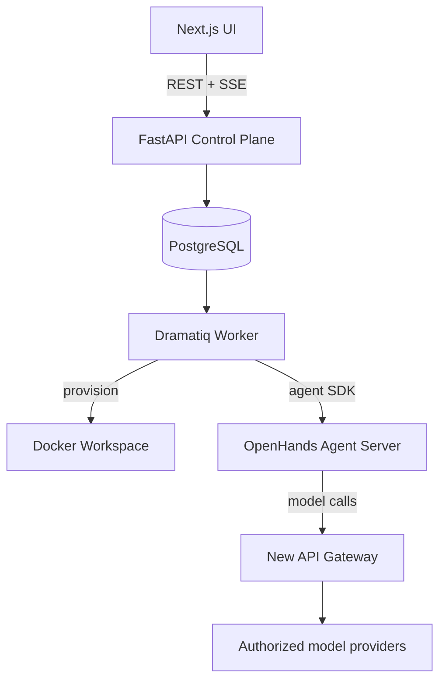

# BudgetLoop

<p align="center"></p>

<p align="center"><strong>A budget-aware coding-agent control plane for planning, execution, evidence, and safe recovery.</strong></p>

<p align="center"><a href="#quick-start">Quick start</a> · <a href="#architecture">Architecture</a> · <a href="#security">Security</a> · <a href="#development">Development</a> · <a href="#license">License</a></p>

[](./LICENSE)
[](https://github.com/bei666qi-pan/BudgetLoop/releases/latest)
[](https://github.com/bei666qi-pan/BudgetLoop/actions/workflows/windows-launcher.yml)
[](https://nextjs.org/)
[](https://fastapi.tiangolo.com/)

**Language:** English · [简体中文](README.zh-CN.md)

BudgetLoop turns an open-ended software task into an auditable operating loop: it plans work, runs agents and tools, evaluates real evidence, accounts for resources, and stops or asks for approval when a boundary is reached. It is designed to make a coding agent observable and controllable—not merely conversational.

> BudgetLoop is an experimental self-hosted system. Run it only with credentials, repositories, and Docker environments you trust.

## Why BudgetLoop?

| Need | BudgetLoop behavior |
| --- | --- |
| Budget you can trust | Atomically reserves and settles token, call, cost, and time budgets around real model calls. |
| Evidence, not agent theatre | Stores tool output, test results, exit codes, timing, artifacts, and execution events. |
| Autonomy with control | Supports guided and autonomous Agent Teams, explicit handoffs, and approval gates. |
| Safe workspace boundaries | Uses per-run Docker workspaces, server-generated worktrees, and explicit direct-folder authorization. |
| Understandable failures | Shows provisioning, execution, warning, and terminal failure states rather than masking a blocked worker as progress. |

## Quick start

### Prerequisites

- Docker Desktop or a compatible Docker daemon
- Docker Compose v2
- An authorized model gateway configuration (New API is the default integration)

```bash
git clone https://github.com/bei666qi-pan/BudgetLoop.git
cd BudgetLoop
cp .env.example .env
# Replace every replace-with-* value in .env.
docker compose up -d
```

Open [http://localhost:3000](http://localhost:3000). For initial gateway setup, see the [Simplified Chinese guide](README.zh-CN.md#本地运行). Update the local application services with:

```bash
docker compose up -d --build control-plane worker web
```

### Desktop launchers

- **macOS:** build with `./desktop/build.sh`, then open `./BudgetLoop.app`.
- **Windows:** download the MSI from the [latest release](https://github.com/bei666qi-pan/BudgetLoop/releases/latest). Docker Desktop, Microsoft Edge WebView2 Runtime, and a local checkout containing `docker-compose.yml` are required.

Launchers preserve `.env`, data services, and Docker volumes while rebuilding BudgetLoop application services.

## The operating loop

```text
Describe a goal → plan work → run model + tools → inspect evidence → adapt or finish
        ↑                                                        ↓
        └──── approval, budget limits, rollback, and reports ────┘
```

1. Create a task or Agent Team from guided setup.
2. Review engine, workspace access, budget, and acceptance criteria.
3. Start the run. BudgetLoop provisions a workspace, creates the agent conversation, records evidence, and updates its lifecycle.
4. Review reports, artifacts, tests, budget usage, and explicit handoffs.

Startup states are literal: queued, preparing workspace, workspace ready/starting agent, running, or failed. A failed startup keeps its workspace diagnosis so it can be corrected and retried intentionally.

## Architecture



| Layer | Technology |
| --- | --- |
| Web | Next.js 15, TypeScript, Tailwind CSS |
| Control plane | FastAPI, SQLAlchemy, PostgreSQL 16 |
| Queue | Dramatiq and Valkey |
| Agent runtime | OpenHands Software Agent SDK and supported CLI engines |
| Workspace | Per-run Docker containers and optional server-generated Git worktrees |
| Gateway | QuantumNous New API by default; LiteLLM compatibility profile |

## Workspace and safety model

- **Isolated workspace (default):** every run writes only to its own Docker-backed workspace.
- **Direct project access:** requires a validated absolute path, explicit acknowledgement, final confirmation, and a compatible server engine. Full-access Agent Teams use server-generated Git worktrees.
- **No silent fallback:** mount, worktree, or agent-server startup failures fail the run rather than executing elsewhere.
- **Approval gates:** risky writes, commands, and network operations can require an operator decision.

## Gateway configuration

The default compose stack includes [New API](https://github.com/QuantumNous/new-api) on `http://localhost:3001`. Create authorized upstream channels and a gateway token, then configure `.env`:

```dotenv
AI_GATEWAY_TYPE=new-api
AI_GATEWAY_BASE_URL=http://new-api:3000
AI_GATEWAY_API_KEY=replace-with-your-gateway-token
AI_GATEWAY_RECOMMENDATION_MODEL=budgetloop-recommendation
```

Restart `control-plane` and `worker` after changing gateway configuration. Gateway credentials stay server-side and are never sent to the browser.

## Development

```bash
# Backend
cd backend && .venv/bin/pytest tests/ -q

# Frontend
cd web && npm test && npm run build
```

Some backend integration tests require Docker and testcontainers. See [`docs/demo-guide.md`](./docs/demo-guide.md) for demonstration workflows.

```text
backend/    FastAPI control plane, worker, orchestration, budgets, policies
web/        Next.js operator experience
desktop/    macOS and Windows launchers
openspec/   Versioned behavior specifications and change proposals
demo/       Example projects
```

## Security

- Keep `.env`, gateway tokens, and provider credentials out of commits and screenshots.
- Prefer isolated workspaces; review a directory and worktree policy before granting direct project access.
- Docker socket access is privileged; production deployments need a hardened Docker boundary.
- See [NOTICE](./NOTICE) for third-party component notices and licenses.

## Roadmap

- Per-run gateway quota integration
- Reproducible A/B/C evaluation evidence
- Deployment hardening and worker-scaling guidance

## Contributing

Issues and pull requests are welcome. Keep changes focused, include tests for behavior changes, and update relevant [`openspec/`](./openspec/) artifacts for meaningful product or architecture changes.

## License

BudgetLoop is released under the [MIT License](./LICENSE). Third-party components retain their own licenses; see [NOTICE](./NOTICE).
