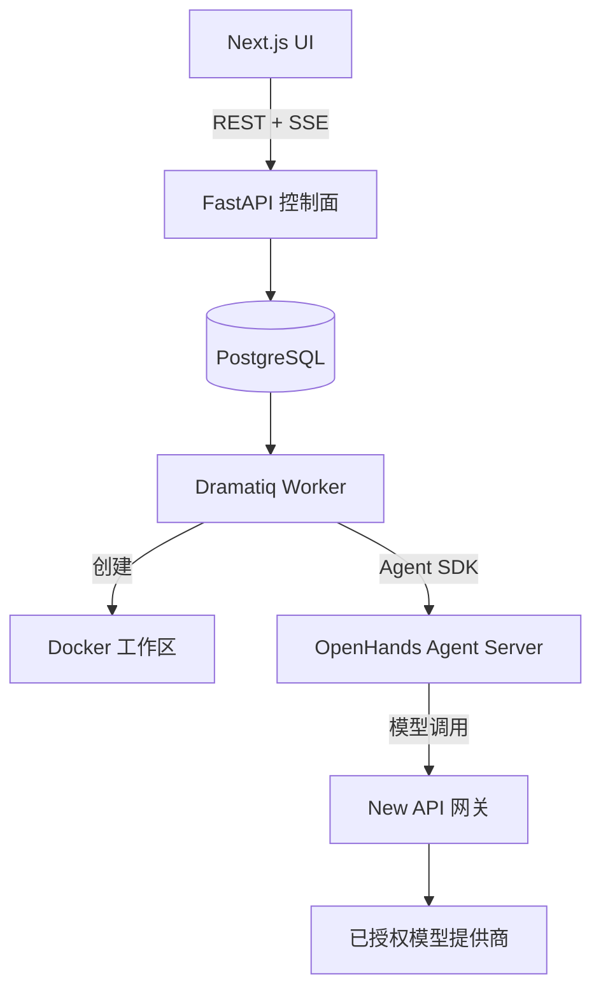

# BudgetLoop

<p align="center"></p>

<p align="center"><strong>面向规划、执行、证据与安全恢复的预算感知 Coding Agent 控制面。</strong></p>

<p align="center"><a href="#快速开始">快速开始</a> · <a href="#架构">架构</a> · <a href="#安全">安全</a> · <a href="#开发">开发</a> · <a href="#许可证">许可证</a></p>

[](./LICENSE)
[](https://github.com/bei666qi-pan/BudgetLoop/releases/latest)
[](https://github.com/bei666qi-pan/BudgetLoop/actions/workflows/windows-launcher.yml)

**语言：** [English](README.md) · 简体中文

BudgetLoop 将开放式软件任务转化为可审计的执行闭环：它规划工作、运行 Agent 与工具、读取真实证据、核算资源，并在达到边界时结束或请求人工审批。它的目标是让 Coding Agent 可观察、可控制，而不只是一个对话界面。

> BudgetLoop 目前是实验性的自托管系统。请只在你信任的 Docker 环境、凭据和项目中运行。

## 为什么使用 BudgetLoop？

| 需求 | BudgetLoop 的做法 |
| --- | --- |
| 可以信任的预算 | 在真实模型调用前后原子化预留和结算 Token、调用次数、费用与时间。 |
| 要证据，不要“表演” | 保存工具输出、测试结果、退出码、耗时、工件和执行事件。 |
| 自主但可控 | 支持引导式/自主式 Agent Team、显式 Handoff 与审批闸门。 |
| 清晰的工作区边界 | 使用每 Run 的 Docker 工作区、服务端生成 Worktree 与显式目录授权。 |
| 可理解的失败 | 显示准备、执行、警告和终态失败，不会把阻塞 Worker 伪装成“正在进行”。 |

## 快速开始

### 前置条件

- Docker Desktop 或兼容的 Docker daemon
- Docker Compose v2
- 已授权的模型网关配置（默认集成 New API）

## 本地运行

```bash
git clone https://github.com/bei666qi-pan/BudgetLoop.git
cd BudgetLoop
cp .env.example .env
# 编辑 .env，替换每一个 replace-with-* 值。
docker compose up -d
```

打开 [http://localhost:3000](http://localhost:3000)。首次配置 New API 时：在 [http://localhost:3001](http://localhost:3001) 创建管理员、上游渠道和网关 Token，将 Token 写入 `.env` 的 `AI_GATEWAY_API_KEY`，然后执行：

```bash
docker compose up -d control-plane worker
```

源代码更新后可重新构建应用服务：

```bash
docker compose up -d --build control-plane worker web
```

### 桌面启动器

- **macOS：**执行 `./desktop/build.sh`，再打开 `./BudgetLoop.app`。
- **Windows：**从[最新 Release](https://github.com/bei666qi-pan/BudgetLoop/releases/latest)下载 MSI。需要 Docker Desktop、Microsoft Edge WebView2 Runtime，以及包含 `docker-compose.yml` 的本地 checkout。

启动器会保留 `.env`、数据服务和 Docker 卷，只重建 BudgetLoop 的应用服务。

## 执行闭环

```text
描述目标 → 规划工作 → 运行模型与工具 → 检查证据 → 调整或结束
     ↑                                             ↓
     └──── 审批、预算限制、回滚和最终报告 ───────────┘
```

1. 通过引导配置创建任务或 Agent Team；
2. 审查执行引擎、工作区权限、预算和验收条件；
3. 启动运行。BudgetLoop 会创建工作区、建立 Agent 对话、记录执行证据并更新生命周期；
4. 审查报告、工件、测试、预算使用和显式 Handoff。

启动状态会如实展示：等待调度、准备工作区、工作区已就绪/正在启动 Agent、运行中或失败。启动失败会保留记录的工作区诊断，便于修复后有意识地重试。

## 架构



| 层级 | 技术 |
| --- | --- |
| Web | Next.js 15、TypeScript、Tailwind CSS |
| 控制面 | FastAPI、SQLAlchemy、PostgreSQL 16 |
| 队列 | Dramatiq 与 Valkey |
| Agent 运行时 | OpenHands Software Agent SDK 与支持的 CLI 引擎 |
| 工作区 | 每 Run 的 Docker 容器和可选的服务端 Git Worktree |
| 网关 | 默认 QuantumNous New API；兼容 LiteLLM profile |

## 工作区与安全模型

- **隔离工作区（默认）：**每个 Run 在独立 Docker 工作区中执行，不会写入宿主项目。
- **直接访问项目：**必须提供已校验的绝对路径、明确风险确认和最终确认；完全访问的 Agent Team 使用服务端生成 Git Worktree 与兼容的服务端引擎。
- **绝不静默降级：**挂载、Worktree 或 Agent Server 启动失败时，Run 会以工作区错误失败，不会在另一目录继续运行。
- **审批闸门：**高风险写入、命令和网络操作可要求人工决策。

## 网关配置

默认 compose 栈包含 [New API](https://github.com/QuantumNous/new-api)，地址为 `http://localhost:3001`。在其控制台创建已授权上游渠道和网关 Token，然后在 `.env` 中填写：

```dotenv
AI_GATEWAY_TYPE=new-api
AI_GATEWAY_BASE_URL=http://new-api:3000
AI_GATEWAY_API_KEY=replace-with-your-gateway-token
AI_GATEWAY_RECOMMENDATION_MODEL=budgetloop-recommendation
```

修改网关配置后请重启 `control-plane` 和 `worker`。网关凭据只保留在服务端，浏览器不会获得它们。

## 开发

```bash
# 后端
cd backend && .venv/bin/pytest tests/ -q

# 前端
cd web && npm test && npm run build
```

部分后端集成测试需要 Docker 和 testcontainers。演示流程见 [`docs/demo-guide.md`](./docs/demo-guide.md)。

```text
backend/    FastAPI 控制面、Worker、编排、预算和策略
web/        Next.js 操作界面
desktop/    macOS 与 Windows 启动器
openspec/   版本化行为规范与变更提案
demo/       示例项目
```

## 安全

- 不要把 `.env`、网关 Token 或供应商凭据提交到仓库或截图中；
- 除非确实需要直接编辑，否则使用隔离工作区；授予访问前请复查目录与 Worktree 策略；
- Docker socket 属于高权限能力；生产环境应采用更严格的 Docker 边界；
- 第三方组件声明见 [NOTICE](./NOTICE)。

## 路线图

- 每 Run 的网关配额集成
- 可复现 A/B/C 证据的评测套件
- 更完善的部署加固与 Worker 扩展指引

## 贡献

欢迎提交 Issue 和 Pull Request。请保持改动聚焦，为行为改变补充测试；对重要产品或架构改动，请同步更新 [`openspec/`](./openspec/) 中的相关规范。

## 许可证

BudgetLoop 使用 [MIT License](./LICENSE) 发布。第三方组件保留各自许可证，详见 [NOTICE](./NOTICE)。
