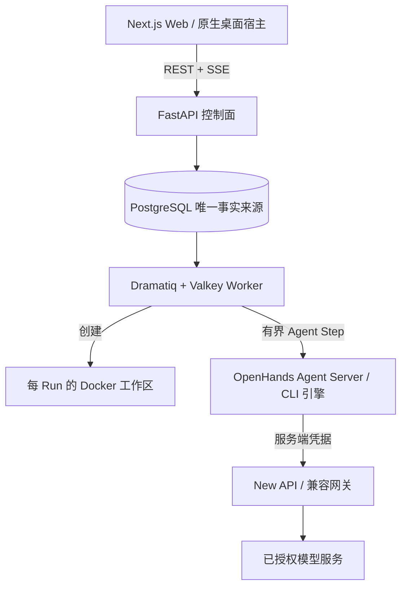

<div align="center">
  
  <h1>BudgetLoop</h1>
  <p><strong>一个预算感知的 Coding Agent 控制面：规划、执行、验证、自我恢复，并按你的边界停止。</strong></p>
</div>

<div align="center">
  <a href="https://github.com/bei666qi-pan/BudgetLoop/releases/latest"></a>
  <a href="https://github.com/bei666qi-pan/BudgetLoop/actions/workflows/release.yml"></a>
  <a href="./LICENSE"></a>
</div>

<div align="center">
  <a href="#快速开始">快速开始</a> ·
  <a href="#桌面应用">桌面应用</a> ·
  <a href="#工作原理">工作原理</a> ·
  <a href="#架构">架构</a> ·
  <a href="#开发">开发</a>
</div>

<p align="center"><a href="./README.md">English</a> · <strong>简体中文</strong></p>

BudgetLoop 把开放式软件需求转化成可审计的执行闭环：运行真实 Agent、工具和测试；跟踪 Token、时间、调用次数与费用预算；保存证据；在进展停滞时调整策略；并把仍需人工决策的边界明确展示出来。

> [!IMPORTANT]
> BudgetLoop 目前是实验性的自托管系统。请只使用你信任的代码仓库、凭据、模型服务和 Docker 环境。

## 最新版本：v0.3.0

Web、后端、macOS 与 Windows 均由同一个 `v0.3.0` 源码修订构建。桌面启动器只是本地 Docker checkout 的原生宿主，不包含 Docker、你的项目代码、模型凭据或在线 BudgetLoop 服务。

| 使用方式 | 当前版本 | 获取方式 | 前置条件 |
| --- | --- | --- | --- |
| **Web** | `0.3.0` | Docker Compose，地址 `http://localhost:3000` | Docker Desktop/Engine + Compose v2 |
| **macOS 应用** | `0.3.0` | [下载 ZIP](https://github.com/bei666qi-pan/BudgetLoop/releases/download/v0.3.0/BudgetLoop-v0.3.0-macos.zip) | macOS 13+、Docker Desktop、本地 BudgetLoop checkout |
| **Windows 应用** | `0.3.0` | [下载 MSI](https://github.com/bei666qi-pan/BudgetLoop/releases/download/v0.3.0/BudgetLoop-v0.3.0-windows-x64.msi) | Windows 10/11、Docker Desktop、WebView2、本地 checkout |
| **后端 / Worker** | `0.3.0` | 包含在 Docker Compose 中 | 源码开发需要 Python 3.12+ |

[版本说明](https://github.com/bei666qi-pan/BudgetLoop/releases/tag/v0.3.0) · [SHA-256 校验和](https://github.com/bei666qi-pan/BudgetLoop/releases/download/v0.3.0/SHA256SUMS) · [全部版本](https://github.com/bei666qi-pan/BudgetLoop/releases)

## 为什么使用 BudgetLoop？

| 你需要什么 | BudgetLoop 提供什么 |
| --- | --- |
| **可信预算** | 围绕真实模型调用，原子化预留和结算 Token、调用次数、费用与时间。 |
| **要证据，不要“表演”** | 保存工具输出、测试结果、退出码、耗时、工件、Diff 与生命周期事件。 |
| **可控的 Agent Team** | 引导式或自主式团队、可并行阶段、显式 Handoff 与人工审批。 |
| **安全的工作区边界** | 每 Run 的 Docker 工作区、服务端 Git Worktree、显式目录授权和失败关闭。 |
| **诚实的进度反馈** | 展示工作区/Agent 启动阶段、动画等待状态、有界重试和可操作的终态错误。 |
| **恢复而不是盲目重试** | 根据确定性进展信号切换策略、回滚、进入最小修复或交付可解释的部分结果。 |

## 快速开始

### 1. 启动最新版 Web 栈

前置条件：Docker Desktop 或 Docker Engine、Docker Compose v2、Git，以及已授权的模型网关。

```bash
git clone --branch v0.3.0 https://github.com/bei666qi-pan/BudgetLoop.git
cd BudgetLoop
cp .env.example .env
# 编辑 .env，替换每一个 replace-with-* 值。
docker compose up -d --build
```

打开 [http://localhost:3000](http://localhost:3000)。首次使用时，可在 [http://localhost:3001](http://localhost:3001) 的 New API 控制台创建管理员、上游渠道、模型别名和 Token。

把网关 Token 写入 `.env` 后刷新应用服务：

```bash
docker compose up -d --build control-plane worker web
```

### 2. 创建 Agent Team

1. 在首页描述你希望交付的结果；
2. 检查建议的团队、执行引擎、验收条件、预算和文件权限；
3. 点击“确认并启动”。仅生成草稿不会创建任务，也不会消耗执行预算；
4. 根据真实状态跟踪启动过程：等待调度 → 准备工作区 → 启动 Agent → 运行中，或查看带恢复动作的明确失败。

## 桌面应用

两个启动器都只刷新无状态的 `control-plane`、`worker` 和 `web` 服务；会保留 `.env`、PostgreSQL、Valkey、New API 与 Docker 卷。

### macOS

1. 将仓库 clone 或更新到 `v0.3.0` tag；
2. 下载 `BudgetLoop-v0.3.0-macos.zip` 并解压到仓库根目录，或执行 `./desktop/build.sh` 本地构建；
3. 启动 Docker Desktop，然后打开 `BudgetLoop.app`。

当前归档采用 ad-hoc 签名保证包完整性，但尚未经过 Apple notarization。macOS 首次启动时可能需要手动确认“打开”。

### Windows

1. 将仓库 clone 或更新到 `v0.3.0` tag；
2. 从 Release 安装 `BudgetLoop-v0.3.0-windows-x64.msi`；
3. 启动 Docker Desktop，打开 BudgetLoop，并在提示时选择包含 `docker-compose.yml` 的 checkout。

当前 MSI 由 CI 构建，但尚未进行 Authenticode 签名，Windows SmartScreen 可能显示“未知发布者”。应用依赖 Microsoft Edge WebView2 Runtime；当前 Windows 通常已自带该组件。

## 工作原理

```text
描述目标 → 规划工作 → 运行模型与工具 → 检查证据 → 调整或结束
     ↑                                                   ↓
     └──── 审批、预算、回滚、Handoff 与最终报告 ─────────┘
```

每次 Run 都有持久化任务、预算、执行时间线、工作区、审批状态、测试证据和最终报告。BudgetLoop 不会把模型声称的“完成”当作真实验收证据。

启动过程有界且可观察。工作区或 Agent 对话正在准备时，UI 会显示当前阶段和等待状态；重复创建失败会转化为保留诊断信息的终态错误，不会让操作员一直面对没有解释的 Spinner。

## 架构



| 层级 | 技术 |
| --- | --- |
| 操作界面 | Next.js 15、React 19、TypeScript、Tailwind CSS、SSE |
| 控制面 | FastAPI、SQLAlchemy、PostgreSQL 16 |
| 队列与瞬态状态 | Dramatiq、Valkey |
| Agent 运行时 | OpenHands Software Agent SDK 与支持的 CLI 引擎 |
| 执行隔离 | 每 Run 的 Docker 工作区；可选的服务端 Git Worktree |
| 模型网关 | 默认 QuantumNous New API；兼容服务端 Profile |
| 桌面端 | macOS 使用 Swift/AppKit；Windows 使用 Rust/Tauri/WebView2 |

## 安全模型

- **默认隔离工作区：**每次 Run 只写入自己的 Docker 工作区；
- **直接项目访问必须显式授权：**需要规范化绝对路径、风险确认、最终确认与兼容引擎；Agent Team 使用独立的服务端 Worktree；
- **绝不静默降级：**挂载、Worktree 或 Agent 启动失败时停止 Run，不会换到其他目录执行；
- **凭据只在服务端：**浏览器 bundle 与响应不会获得网关或模型供应商密钥；
- **风险操作可审批：**写入、命令和网络操作可以要求操作员确认。

## 网关配置

默认栈包含 [QuantumNous New API](https://github.com/QuantumNous/new-api)。创建已授权渠道与 Token 后配置：

```dotenv
AI_GATEWAY_TYPE=new-api
AI_GATEWAY_BASE_URL=http://new-api:3000
AI_GATEWAY_API_KEY=replace-with-your-gateway-token
AI_GATEWAY_RECOMMENDATION_MODEL=budgetloop-recommendation
```

不要提交 `.env`，也不要在截图或 Issue 中泄露凭据。

## 开发

```bash
# 后端
cd backend
python -m venv .venv
source .venv/bin/activate
pip install -e ".[dev]"
pytest

# Web（另一个终端）
cd web
npm ci
npm test
npm run build

# macOS 启动器
./desktop/build.sh

# Windows 启动器（在 Windows 上）
cd desktop/windows
npm ci
cargo test --manifest-path src-tauri/Cargo.toml
npm run tauri -- build --bundles msi
```

检查全部发布入口是否与根版本一致：

```bash
python3 scripts/check_release_version.py
```

```text
backend/    API、编排、预算、策略和 Worker
web/        浏览器操作界面
desktop/    macOS 与 Windows 原生启动器
openspec/   版本化产品要求与变更历史
docs/       演示与发布文档
```

重要行为与架构变更使用仓库的 [OpenSpec 工作流](./openspec/)。演示流程见 [docs/demo-guide.md](./docs/demo-guide.md)。

## 发布完整性

`v0.3.0` tag 触发同一条跨平台工作流。只有版本一致性、后端测试、Web 测试/构建、macOS bundle 版本/签名、Windows 启动器测试和 MSI 构建全部通过后，才会发布桌面工件。可使用 `SHA256SUMS` 验证下载文件：

```bash
shasum -a 256 -c SHA256SUMS   # macOS
sha256sum -c SHA256SUMS       # Linux / Git Bash
```

## 贡献

欢迎提交 Issue 与聚焦的 Pull Request。行为变化需要测试；重要产品或架构变化需要同步相关 OpenSpec 要求。

## 许可证

BudgetLoop 使用 [MIT License](./LICENSE)。第三方组件保留各自许可证，详见 [NOTICE](./NOTICE)。
